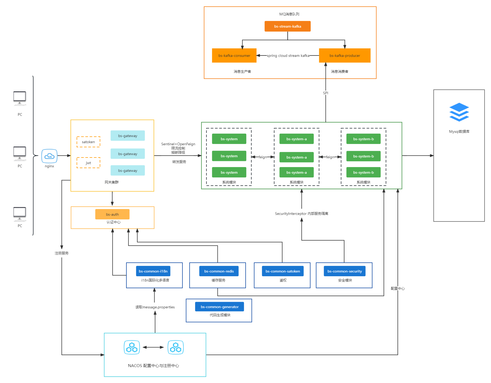

<h1 style="margin: 30px 0 30px; font-weight: bold;text-align: center">基础开发框架 - spring-cloud微服务版本</h1>

### 简介

该项目是一套前后端分离的微服务框架，适用于中、大型项目。

### 框架能力

- 基于spring全家桶的微服务架构
- 带有服务网关、认证中心、注册中心、配置中心、系统监控、熔断降级、负载均衡、服务限流、消息队列等基本组件
- 项目由多模块组成，扩展性很强，可集群部署

### 技术选型

##### 1、系统环境

- Java 11
- Apache Maven 3

##### 2、核心框架

- Spring Boot 2.7.3
- Spring Cloud 2021.0.4
- Spring Cloud Gateway 3.1.4
- Spring Cloud Alibaba 2021.0.4.0
- Spring Cloud Alibaba Nacos 2.0.4
- Spring Cloud Alibaba Sentinel 2021.0.4.0

##### 3、权限认证框架
- Sa-token 1.33.0
- Jwt 4.2.1

##### 4、持久层框架
- Mybatis-plus 3.5.2
- Druid  1.2.15

##### 5、数据库
- Mysql 8.0

##### 6、缓存
- Redis

##### 7、消息队列
- Kafka 3.3.1
- Spring Cloud Stream Kafka 3.1.0

##### 8、前端
- Angular 10.2.4
- Rxjs 6.6.0
- Ng-zorro-antd 10.2.2
- Typescript 4.0.2

### 系统模块

    bs-cloud    
    ├── bs-ui                          // 前端框架 [4200]
    ├── bs-gateway                     // 网关模块 [8081]
    ├── bs-auth                        // 认证中心 [8082]
    ├── bs-api                         // 接口模块
    │       └── bs-api-system          // 提供bs-system feign接口
    ├── bs-common                      // 通用模块
    │       └── bs-common-core         // 核心模块
    │       └── bs-common-generator    // 代码生成模块
    │       └── bs-common-i18n         // 国际化i18n模块
    │       └── bs-common-redis        // 缓存服务
    │       └── bs-common-satoken      // 鉴权模块
    │       └── bs-common-security     // 安全模块
    ├── bs-modules                     // 业务模块
    │       └── bs-system              // 系统模块 [8083]
    ├── bs-stream-kafka                // mq模块（kafka）
    │       └── bs-kafka-consumer      // 消费者[8085]
    │       └── bs-kafka-producer      // 消息提供者
    ├── bs-visual
    │       └── bs-monitor             // 系统监控 [8084]
    ├──pom.xml                         // 公共依赖

### 系统架构图

